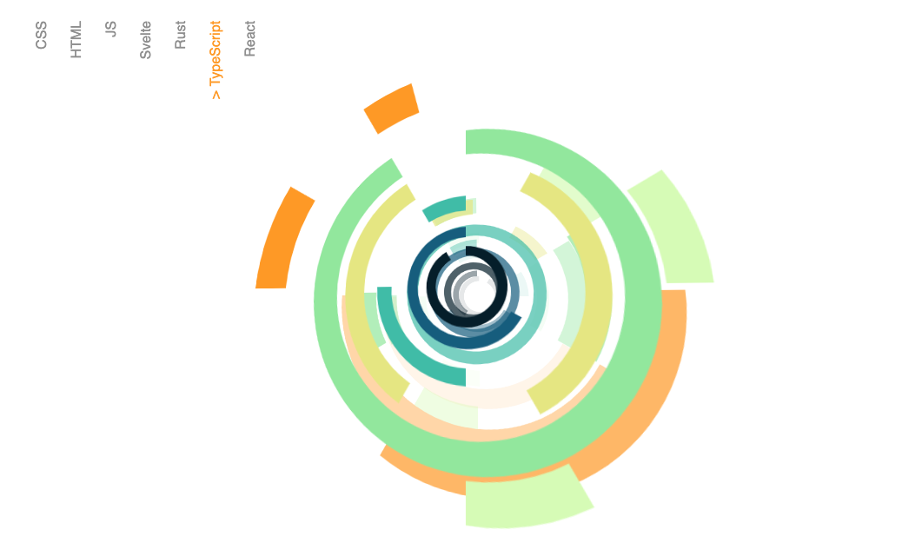

#Heartwood Visualize

Heartwood is a data visualization component built with d3.js, Svelte, and some CSS transformation magic. WIP for new web presence.

##Goal

Visualize a skillset as a series of concentric rings set in semi-3D space.

Instead of a static radial graph or pie chart, Heartwood attempts to visualize the growth of a skillset over time, much like tree rings. Each ring is a specific skill (i.e. Javascript/Typescript). The duration or "length" of a ring refers to the amount of time that skill was used (in months). Foundational skills are located in the center while more advanced skills make up outer rings.

A "layer" of rings is a visualization for a single year. Prior years are visualized as further ring layers receding into 3d space.

##Roadmap

- add accelerometer support for mobile devices
- add legend that displays each skill duration for years
- support for multiple color schemes
- dark/light mode
- support for larger/deeper skillsets
